# CSV 智能拆分工具 - 可视化文档

## 1. 核心流程图

### 1.1 主流程（split 命令）

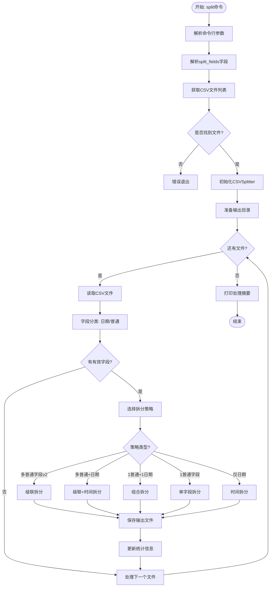

### 1.2 字段分类流程

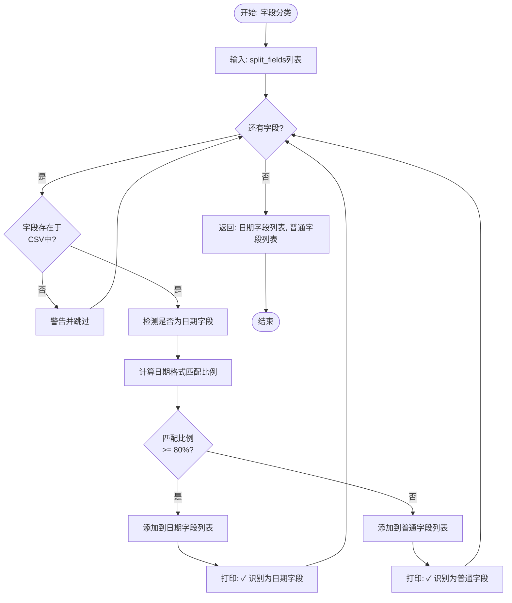

### 1.3 拆分策略决策流程

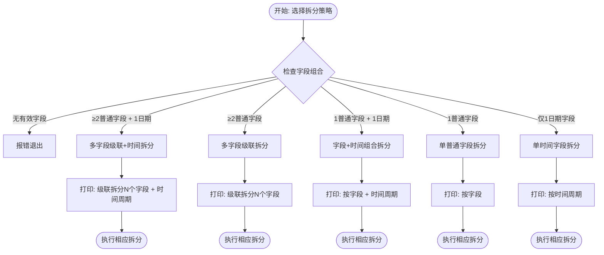

### 1.4 多字段级联拆分流程（递归）

```mermaid
flowchart TD
    Start([开始: 级联拆分]) --> Init[level = 0<br/>suffix = '']

    Init --> CheckLevel{level >=<br/>字段数量?}
    CheckLevel -->|是| SaveFile[调用_split_by_size保存]
    SaveFile --> Return([返回文件列表])

    CheckLevel -->|否| GetField[current_field = fields[level]]
    GetField --> GetUnique[获取唯一值列表]
    GetUnique --> PrintInfo[打印: 第N层拆分, 找到X个值]

    PrintInfo --> ValueLoop{还有唯一值?}
    ValueLoop -->|是| FilterDF[过滤: df[field] == value]
    FilterDF --> SafeName[生成安全文件名]
    SafeName --> BuildSuffix[new_suffix = suffix + '_' + safe_name]
    BuildSuffix --> Recursive[递归调用: level + 1]
    Recursive --> ValueLoop

    ValueLoop -->|否| Return
```

### 1.5 二次拆分流程（按行数）

```mermaid
flowchart TD
    Start([开始: 二次拆分]) --> GetTotal[total_rows = len(df)]

    GetTotal --> CheckThreshold{max_rows<br/>是否设置?}
    CheckThreshold -->|否| SaveDirect[直接保存完整文件]
    CheckThreshold -->|是| CheckSize{total_rows <=<br/>max_rows?}

    CheckSize -->|是| SaveDirect
    CheckSize -->|否| CalcParts[计算拆分份数<br/>num_parts = ceil(total/max_rows)]

    SaveDirect --> FormatName[文件名: base_name + suffix + .csv]
    FormatName --> WriteFile[写入CSV]
    WriteFile --> Return1([返回文件列表])

    CalcParts --> PartLoop{part < num_parts?}

    PartLoop -->|是| CalcRange[start = part * max_rows<br/>end = min((part+1)*max, total)]
    CalcRange --> SliceDF[part_df = df.iloc[start:end]]
    SliceDF --> FormatPartName[文件名: base_name + suffix + _part{part+1}.csv]
    FormatPartName --> WritePart[写入CSV]
    WritePart --> Increment[part++]
    Increment --> PartLoop

    PartLoop -->|否| Return2([返回文件列表])
```

---

## 2. 状态图

### 2.1 文件处理状态机

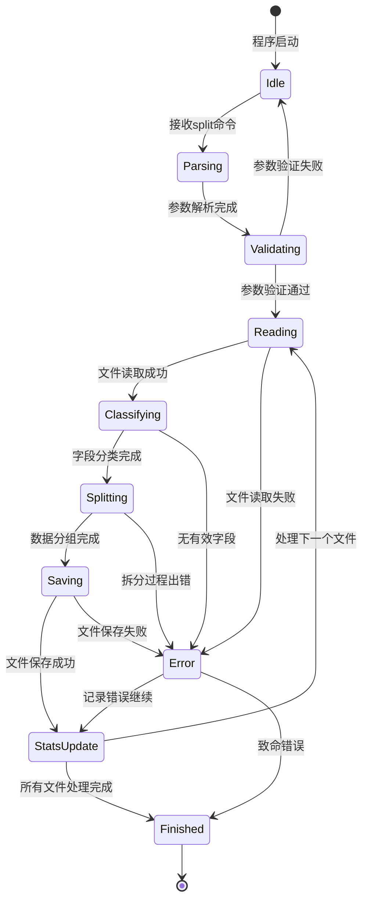

### 2.2 日期字段检测状态

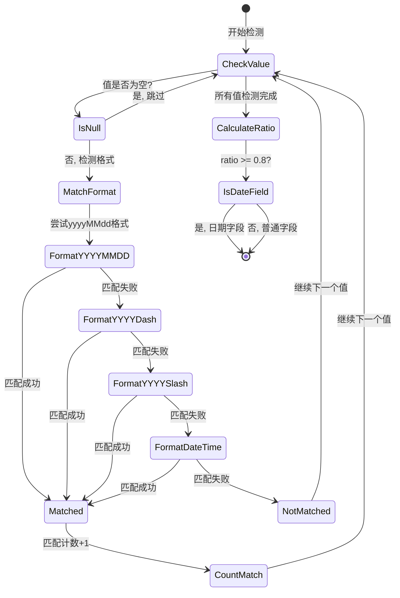

---

## 3. 数据流图

### 3.1 系统数据流

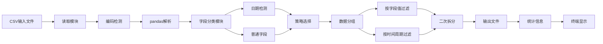

### 3.2 拆分数据流转示例

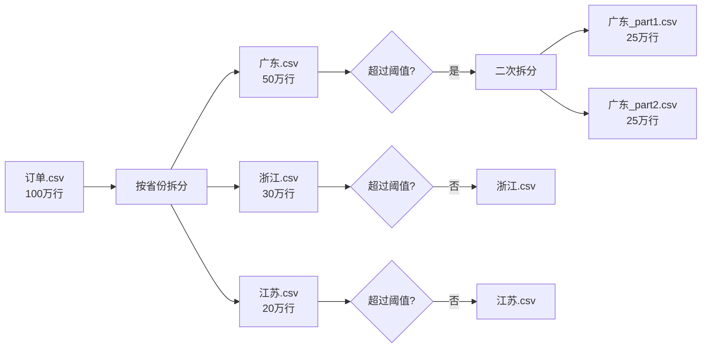

---

## 4. 时序图

### 4.1 split命令执行时序

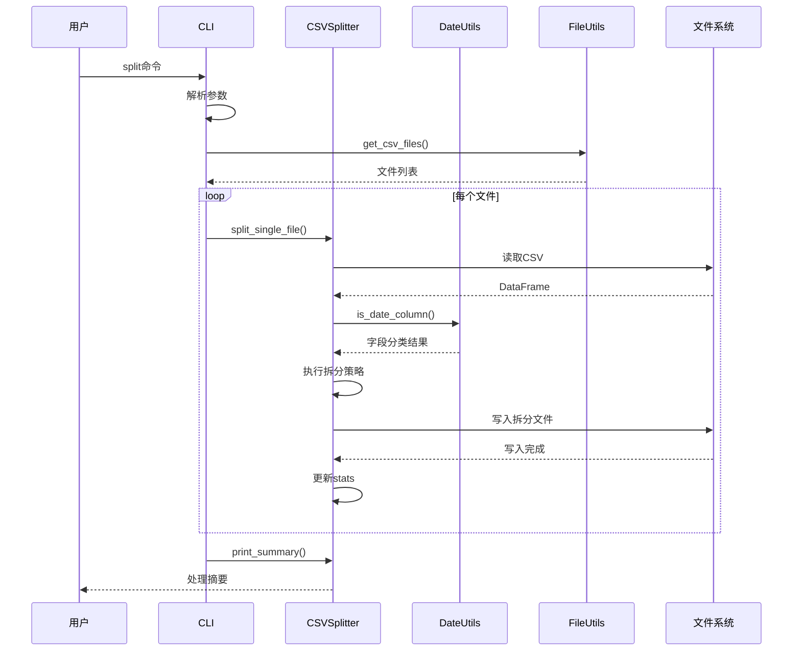

### 4.2 多字段级联拆分时序

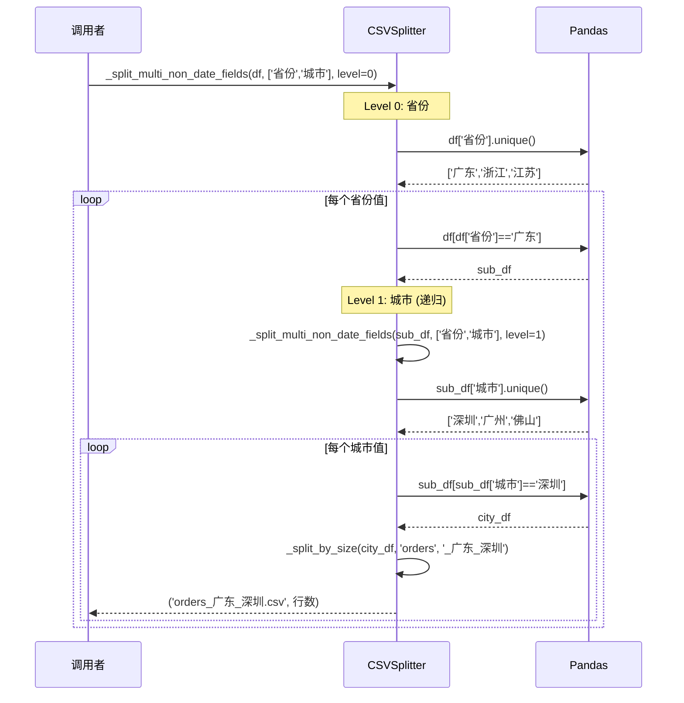

---

## 5. 示例展示

### 5.1 示例数据与拆分结果

#### 输入数据示例

| 订单ID | 省份 | 城市 | 订单日期 | 金额 |
|--------|------|------|----------|------|
| 001 | 广东 | 深圳 | 2024-01-10 | 100 |
| 002 | 广东 | 广州 | 2024-01-20 | 200 |
| 003 | 广东 | 深圳 | 2024-02-05 | 150 |
| 004 | 浙江 | 杭州 | 2024-01-15 | 300 |
| 005 | 浙江 | 宁波 | 2024-02-10 | 250 |
| 006 | 江苏 | 南京 | 2024-01-25 | 180 |

#### 拆分策略与结果对比

| 拆分命令 | 输出文件 | 说明 |
|---------|---------|------|
| `--split-fields "省份"` | `orders_广东.csv`<br/>`orders_浙江.csv`<br/>`orders_江苏.csv` | 按省份拆分 |
| `--split-fields "省份,城市"` | `orders_广东_深圳.csv`<br/>`orders_广东_广州.csv`<br/>`orders_浙江_杭州.csv`<br/>`orders_浙江_宁波.csv`<br/>`orders_江苏_南京.csv` | 级联拆分 |
| `--split-fields "省份,订单日期" --time-period M` | `orders_广东_2024-01.csv`<br/>`orders_广东_2024-02.csv`<br/>`orders_浙江_2024-01.csv`<br/>`orders_浙江_2024-02.csv`<br/>`orders_江苏_2024-01.csv` | 字段+月份 |
| `--split-fields "订单日期" --time-period Q` | `orders_2024-Q1.csv` | 按季度 |

### 5.2 时间周期拆分示例

#### 按不同周期拆分的文件名对比

| 原数据 | 年(Y) | 半年(H) | 季度(Q) | 月(M) | 半月(HM) | 日(D) |
|--------|-------|---------|---------|-------|----------|-------|
| 2024-01-10 | `orders_2024.csv` | `orders_2024-H1.csv` | `orders_2024-Q1.csv` | `orders_2024-01.csv` | `orders_2024-01-HM1.csv` | `orders_2024-01-10.csv` |
| 2024-01-20 | `orders_2024.csv` | `orders_2024-H1.csv` | `orders_2024-Q1.csv` | `orders_2024-01.csv` | `orders_2024-01-HM2.csv` | `orders_2024-01-20.csv` |
| 2024-02-05 | `orders_2024.csv` | `orders_2024-H1.csv` | `orders_2024-Q1.csv` | `orders_2024-02.csv` | `orders_2024-02-HM1.csv` | `orders_2024-02-05.csv` |
| 2024-07-15 | `orders_2024.csv` | `orders_2024-H2.csv` | `orders_2024-Q3.csv` | `orders_2024-07.csv` | `orders_2024-07-HM1.csv` | `orders_2024-07-15.csv` |

### 5.3 二次拆分示例

#### 场景：大文件拆分

```
输入: orders.csv (150万行)
拆分字段: "省份"
行数阈值: 50万行

第1步: 按省份拆分
├── 广东.csv (80万行) → 超过阈值!
├── 浙江.csv (40万行)
└── 江苏.csv (30万行)

第2步: 二次拆分
├── 广东_part1.csv (50万行)
├── 广东_part2.csv (30万行)
├── 浙江.csv (40万行)
└── 江苏.csv (30万行)
```

### 5.4 输出目录结构示例

```
split_data/
├── 订单数据_广东_深圳_2024-01-HM1.csv
├── 订单数据_广东_深圳_2024-01-HM2.csv
├── 订单数据_广东_广州_2024-01-HM1.csv
├── 订单数据_广东_广州_2024-01-HM2.csv
├── 订单数据_浙江_杭州_2024-01-HM1.csv
├── 订单数据_浙江_杭州_2024-01-HM2.csv
└── 订单数据_江苏_南京_2024-01-HM1.csv
```

---

## 6. 输出界面展示

### 6.1 split命令输出示例

```
🚀 CSV智能拆分工具 v1.4
============================================================
输入路径: ./data/orders.csv
拆分字段: 省份,订单日期
时间周期: M
行数拆分: ✅ 每 500,000 行
输出目录: ./split_data
============================================================

解析后的字段: ['省份', '订单日期']

找到 1 个CSV文件

============================================================
处理文件: ./data/orders.csv
============================================================
  总行数: 1,500,000
  字段数: 10
  行数拆分: ✅ 单文件最大 500,000 行
  ✓ '省份' 识别为普通字段
  ✓ '订单日期' 识别为日期字段

  拆分策略: 按 '省份' + '订单日期' (时间周期: M)
     第一层拆分: 找到 3 个 '省份' 值

     第1层 ('省份'): 3 个值
       拆分: 100%|██████████| 3/3

  ✅ 完成! 生成 36 个文件:
     - 订单数据_广东_2024-01.csv (450,000 行)
     - 订单数据_广东_2024-02.csv (350,000 行)
     - 订单数据_浙江_2024-01.csv (300,000 行)
     - 订单数据_浙江_2024-02.csv (200,000 行)
     - 订单数据_江苏_2024-01.csv (150,000 行)
     - 订单数据_江苏_2024-02.csv (50,000 行)

============================================================
处理完成!
============================================================
输入文件: 1
总行数: 1,500,000
输出文件: 36
输出目录: /path/to/split_data
```

### 6.2 list-fields命令输出示例

```
📋 文件字段列表
============================================================
文件: ./data/orders.csv
编码: utf-8

总字段数: 10
============================================================
  1. 📅 日期 | 订单日期              | 样例: 20240115
  2. 📅 日期 | 结算日期              | 样例: 2024-01-15
  3. 📝 普通 | 省份                  | 样例: 广东
  4. 📝 普通 | 城市                  | 样例: 深圳
  5. 📝 普通 | 网点                  | 样例: 南山营业点
  6. 📝 普通 | 客户类型              | 样例: VIP
  7. 📝 普通 | 订单状态              | 样例: 已完成
  8. 📝 普通 | 支付方式              | 样例: 微信支付
  9. 📝 普通 | 物流公司              | 样例: 顺丰速运
 10. 📝 普通 | 金额                  | 样例: 299.5
```

---

## 7. 时间周期可视化

### 7.1 时间周期层级关系

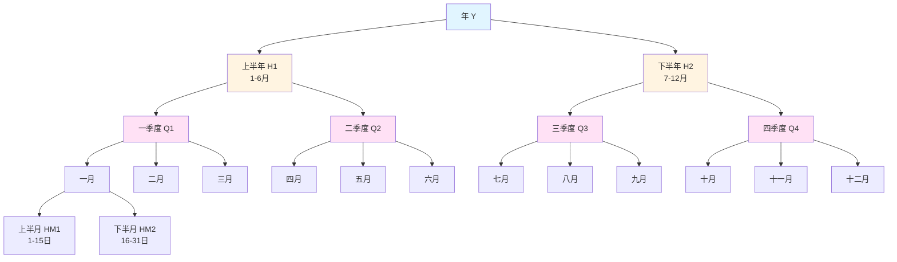

### 7.2 时间周期格式对比

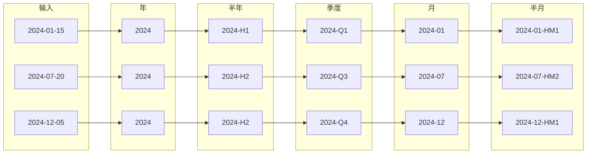

---

## 8. 错误处理流程

### 8.1 文件读取错误处理

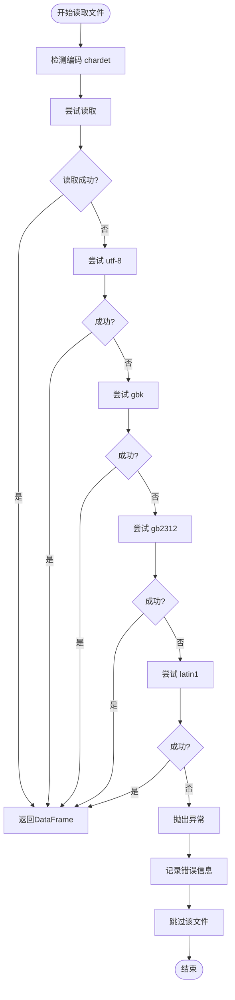

### 8.2 日期处理空值流程

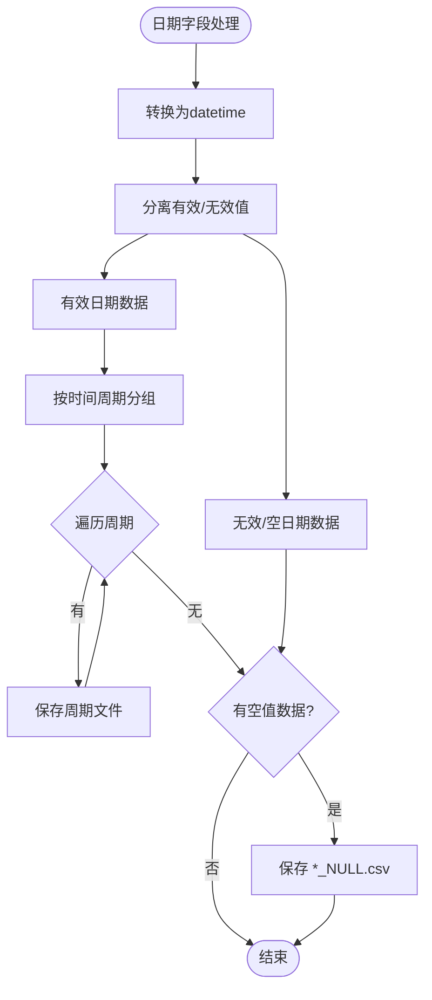

---

## 9. 性能分析图

### 9.1 处理时间与数据规模关系

```
处理时间 (秒)
    │
 60 │                                    ╭────
 50 │                              ╭────╯
 40 │                        ╭────╯
 30 │                  ╭────╯
 20 │            ╭────╯
 10 │      ╭────╯
  0 │────╯
    └────────────────────────────────────────
      10万   30万   50万   80万  100万  150万
                    数据行数
```

### 9.2 内存使用与字段层级关系

```
内存占用 (MB)
    │
500 │                                    ╭────
400 │                              ╭────╯
300 │                        ╭────╯
200 │                  ╭────╯
100 │            ╭────╯
 50 │      ╭────╯
  0 │────╯
    └────────────────────────────────────────
       1层    2层    3层    4层    5层    6层
                    字段层级
```

---

## 10. 快速参考

### 10.1 命令速查表

| 需求 | 命令 |
|-----|------|
| 查看字段 | `python csv_splitter.py list-fields --file data.csv` |
| 单字段拆分 | `python csv_splitter.py split --input data.csv --split-fields "省份"` |
| 按月拆分 | `python csv_splitter.py split --input data.csv --split-fields "日期" --time-period M` |
| 字段+月份 | `python csv_splitter.py split --input data.csv --split-fields "省份,日期" --time-period M` |
| 大文件拆分 | `python csv_splitter.py split --input data.csv --split-fields "省份" --max-rows 100000` |
| 批量处理 | `python csv_splitter.py split --input ./data/ --split-fields "日期" --recursive` |

### 10.2 时间周期速查表

| 符号 | 含义 | 示例输出 |
|-----|------|---------|
| Y | 年 | `2024.csv` |
| H | 半年 | `2024-H1.csv`, `2024-H2.csv` |
| Q | 季度 | `2024-Q1.csv` ~ `2024-Q4.csv` |
| M | 月 | `2024-01.csv` ~ `2024-12.csv` |
| HM | 半月 | `2024-01-HM1.csv`, `2024-01-HM2.csv` |
| D | 日 | `2024-01-15.csv` |

### 10.3 文件命名规则速查

| 场景 | 命名格式 | 示例 |
|-----|---------|------|
| 标准输出 | `{原名}_{字段值}.csv` | `orders_广东.csv` |
| 多字段 | `{原名}_{字段1}_{字段2}.csv` | `orders_广东_深圳.csv` |
| 含时间 | `{原名}_{字段}_{时间}.csv` | `orders_广东_2024-01.csv` |
| 含季度 | `{原名}_{字段}_{时间}.csv` | `orders_广东_2024-Q1.csv` |
| 含半月 | `{原名}_{字段}_{时间}.csv` | `orders_广东_2024-01-HM1.csv` |
| 二次拆分 | `{原名}_{字段}_part{N}.csv` | `orders_广东_part1.csv` |
| 空值 | `{原名}_{字段}_NULL.csv` | `orders_省份_NULL.csv` |
